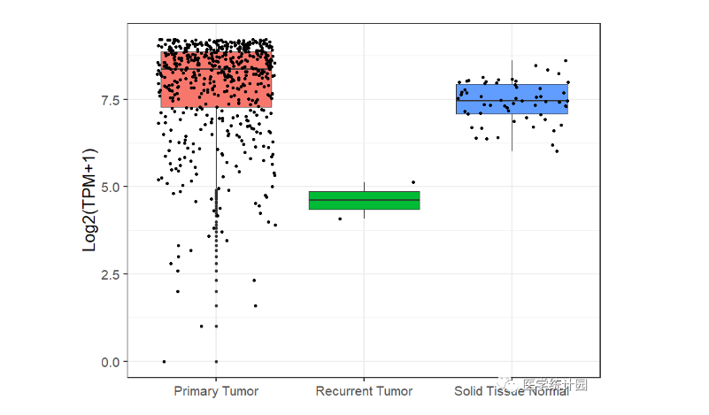

# TCGAExpression

## 目的
可视化gene 在TCGA 各项目中的表达。

## 使用方法

主要有以下3中功能：

+ 获取基因表达

+ 对基因表达进行可视化

+ 获取TCGA项目

### 获取基因表达

```R
library(TCGAExpression)

df=getExpression('TP53','TCGA-LUAD')

head(df)
```


### 基因表达可视化

在`tumor` 和 `normal`组，分别可视化基因的表达

```R
getBoxplot(df)
```




### 获取TCGA项目

```R
getProjects()
```


【医学统计园】出品，可联系dongliulou@126.com 获取更多支持。